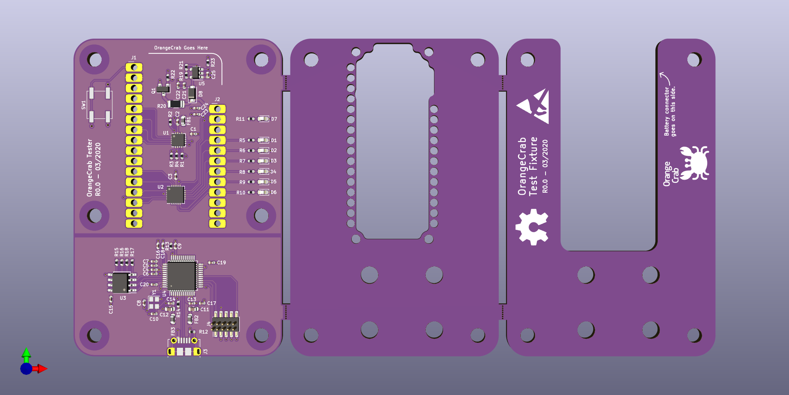

# orangecrab-test

Parts required:
 - 1x PCB panel (Break into 3 seperate layers)
 - 1x PCB BOM
 - 4x 20mm Standoffs [dk:36-24437-ND](https://www.digikey.com.au/product-detail/en/keystone-electronics/24437/36-24437-ND/1532169)
 - 1x 150mm 10-pin cable [dk:1528-2009-ND](https://www.digikey.com.au/product-detail/en/adafruit-industries-llc/1675/1528-2009-ND/6827142)
 - 8x M3x8mm Socket Head Cap Screw (Body)
 - 4x M4x12mm Socket Head Cap Screw (Clamp)
 - 4x M4 Nyloc Nut
 - 1x M4x16mm Socket Head Cap Screw (Effector)
 - 1x M4 Nut

3d printed parts:
 - 1x orangecrab-test-pogo-aligner.stl  
 - 1x orangecrab-test-effector.stl  
 - 4x orangecrab-test-feet.stl  
 - 4x orangecrab-test-spacer.stl

Assembled view:

